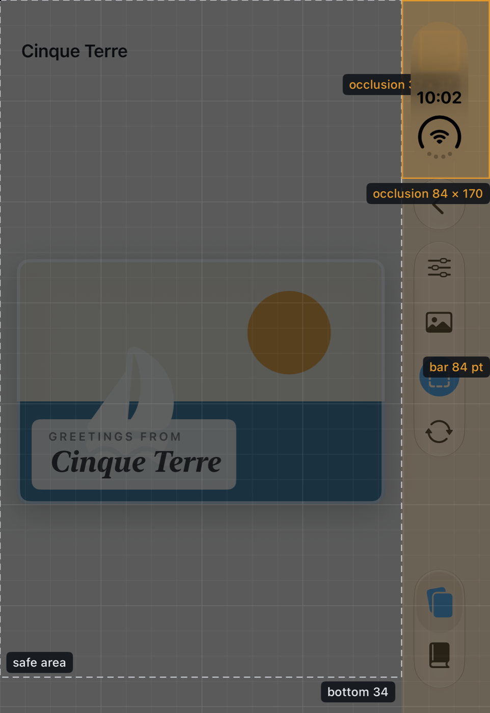
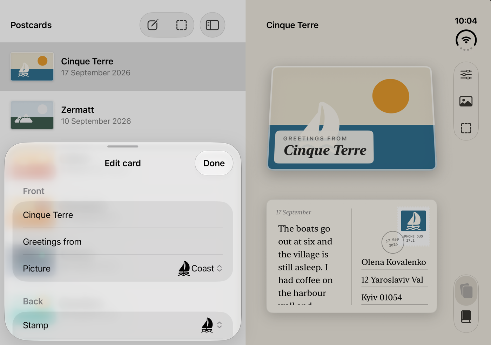

# What the iPhone Duo simulator actually reports

*Field note, 26 September 2026. Measured on the iOS 27.1 simulator runtime 24A94401 in Xcode 27.1 beta 27A9269; hardware ships on 23 October and may differ. Styled version: https://ihormalovanyi.github.io/iphone-duo-companion/*

Apple's iPhone Duo documentation tells you what the APIs are. A probe app, a few hundred folds in Device Hub and one hidden slider tell you what they return.

Apple's iPhone Duo pages are good at telling you what the APIs are. They say much less about what the APIs return. So I put a probe app on the iOS 27.1 simulator, folded it a few hundred times with Device Hub, and wrote down what came back. This is the part that changed how I write layout code.

### The hidden slider

Device Hub shows three pose buttons: closed, partially folded, open. Hold Option with the pointer over that bar and the buttons turn into a hinge slider, 0 to 180 degrees. Apple's pages do not mention it. It answers a question the buttons cannot, what iOS does between the poses, and the answer depends on how you move it.

- **Drag** the slider and the hinge status flips from closed to partially open at about 20 degrees; the app jumps from the outer display to the inner one at that moment. Drag back and it reads closed again at 27 degrees in one sweep and at 46 in another. Fully open is reported only at 180.0.
- **Click** the slider and the simulator settles by band: 36.6, 71.2, 108.6 and 123.3 degrees all ended as closed, app on the outer display. 143.1 ended as partially open, app on the inner display. The boundary sits where the 128-degree fold button lives.

Same angle, different pose. The lesson is not about the simulator. Never derive the pose from `DeviceHinge.angle`: react to `status` and to the scene's geometry, and keep the angle for effects.

### The fold is a region, and its switch is not an angle

The crease is a `ReservedRegion` of kind `.division`: 40 pt across the fold, with 20 pt margins on the fold axis, 455.5 pt from the edge of the 951 pt side. That frame never changed in any pose. Its `isActive` flag did, and not as a function of the angle: in four continuous sweeps it switched on at 98, 132.5, 132.5 and 172.6 degrees, then stayed on until the device closed, and it was off at 180. Query reserved regions on every layout pass and lay out from what they say. Do not cache them, and do not write `if angle < 130`.

### The bar follows the camera

Closed, the system moves a tab bar into a vertical column, 84 pt wide, on the edge that carries the front camera. Rotate the device and the column follows the camera: trailing in portrait and landscape left, leading in landscape right. `toolbarVerticalEdge` in SwiftUI and `verticalBarEdge` in UIKit report the side, and the safe-area inset on that edge is 84 pt. Open in the wide layout the bar is vertical again on the trailing edge; in the tall layout the bars are horizontal, with 82 pt top and 83 pt bottom insets. If a control of yours is placed "on the right", read the edge first.

### Size classes, closed and rotated

The outer display never changes, so it is tempting to assume its size classes do not either. They do: compact width with regular height in portrait, compact height in landscape, like any other iPhone. A layout keyed to size classes flips when the closed device rotates. Key bar placement to the vertical-edge values and let the width class decide only what it should, one column or two.

### A sheet knows where the fold is

This one needed no probe. Present a plain `.sheet` with medium and large detents from the detail column of a `NavigationSplitView`. Closed, it rises to half height over the content. Open in the wide layout, it is centred across the scene. Folded like a book, it sits over the leading panel only and leaves the fold alone. Folded like a laptop, it fills the lower panel and your content stays in the upper one. Zero pose-specific code. Most of adapting to iPhone Duo is not fighting the system.

*Closed pose with the Blueprint overlay: the bar's 84 pt strip, the 84 × 170 pt status-column region, the safe area. Every line comes from an API the app can query.*

*Book pose: the sheet takes the leading panel and the card stays on the trailing one. Nothing in the code mentions the fold.*

| Measured | Value | Where |
|----|----|----|
| Outer display scene | 466 × 678 pt, compact × regular (portrait); 678 × 466, compact × compact (landscape) | closed |
| Inner display scene | 669 × 951 pt tall, 951 × 669 wide, regular × regular | open, book, laptop |
| Vertical bar strip | 84 pt on the camera's edge; top 82 / bottom 83 pt insets in the tall layout | closed, wide, tall |
| Division region | 40 pt frame, 20 pt margins, 455.5 pt from the edge; active only while folded | book, laptop |
| Hinge status while dragging | partially open from 20.0–20.8°; closed again at 27.0° or 45.9°; fully open at 180.0° only | slider |
| Hinge status after a click | closed at 36.6, 71.2, 108.6, 123.3°; partially open at 143.1° | slider |
| Software keyboard | 669 × 350 tall, 951 × 264 wide, 678 × 230 closed landscape, 466 × 289 closed portrait | all but laptop |

### How this was measured

The probe logs one JSON line per layout pass, hinge update, scene change and keyboard notification: scene size, size classes, safe-area insets, bar edge, reserved regions with their frames and flags, hinge status and angle. Every value above comes from settled records, never from the frames the simulator logs during a rotation. The probe, DuoProbe, ships in the companion project below.

### Where this comes from

This field note is a slice of *Developing for iPhone Duo: Approaches and Tips*, a 160-page handbook for iOS developers: nineteen chapters, SwiftUI first with UIKit alongside, every number Apple does not publish measured and labelled, every listing cut from an Xcode project that builds. Launch Edition now; the hardware-verified v1.1 is a free update for every buyer.

- [The book on Gumroad](https://ihormalovanyi.gumroad.com/l/iphone-duo) (PDF, EPUB, companion project)
- [The first chapter, free](https://ihormalovanyi.gumroad.com/l/iphone-duo-sample)
- [Companion code on GitHub](https://github.com/ihormalovanyi/iphone-duo-companion): DuoLab, DuoProbe and Postcards, the app in the pictures
- [Below the Glass](https://claude.ai/artifact/8KNgYdi93aLYYCC9bTnrUX), the main series on what iOS 26 hides

